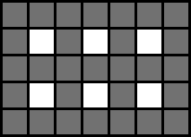

# Maze class

Header: [`maze.h`](../src/maze.h)

### Different grid types
You can access and manipulate the contents of the maze using two different coordinate systems or 'grid types'.
- The first is `GridType::ALL`, which includes all cells **and** walls as they would be displayed for example
in an image.
- The second is `GridType::CELLS`, which includes **only** the cells

In the image below all cells are marked white and all walls are marked gray:




### Constructing
For creating a maze you need to call the constructor with the
desired width and height in cells:
```c++
// Maze(std::size_t width, std::size_t height);
Maze maze(100, 150);
```


Additionally you can supply an entrance and an exit position (x value in cell grid / entrance always on top, exit always on bottom):
```c++
// Maze(std::size_t width, std::size_t height, std::size_t entrancePos, std::size_t exitPos);
Maze maze(100, 150, 50, 70);
```


### Pos vs Point
A value in the maze can be accessed either by supplying a point or a position.
- A point consists of an x and a y value which count from left to right/top to bottom and start at 0\
|(0,0)|(1,0)|(2,0)|(3,0)|(4,0)|\
|(0,1)|(1,1)|(2,1)|(3,1)|(4,1)|
- A position represents the number of the value counting row by row\
|0|1|2|3|4|\
|5|6|7|8|9|

You can convert between the two representations by using one of the following member functions:
- `std::size_t convertToPos(const Point& point, GridType gridType) const`
- `Point convertToPoint(std::size_t, GridType gridType) const`

### Converting between grid types
You can convert between the different grid types by using one of the following member functions:
- `std::size_t convertPos(std::size_t pos, GridType targetGridType) const`
- `Point convertPoint(const Point& point, GridType targetGridType) const`

### Accessing and changing data

You can get the data stored in the maze using one of the `get` member functions:
```c++
// using the point variant
// returns true for an active cell
bool value = maze.get({3, 2}, GridType::CELLS);
```

Similarly you can set a value by using one of the `set` member functions:
```c++
// using the point variant
// true turns the cell on
maze.set({3, 2}, GridType::CELLS, true);
```

#### Accessing and changing walls of specific cells

Even though you could change the walls of a given cell by using the complete grid type, libmaze 
provides a few convenience functions for that:
- `bool getWallOfCell(const Point& point, Direction direction) const`
- `void setWallOfCell(const Point& point, Direction direction, bool value)`

**WARNING:** Trying to access walls that are part of the border (e.g. trying to access the top wall of a cell with y=0)
will result in a `std::runtime_error` exception being thrown.

### Generating
Mazes can be generated by passing an implementation of the [IGenerator interface](generators/Generator.md) to the
`void generate(IGenerator& generator)` member function.

**NOTE:** This will override all previous contents of the maze.

### Saving
Mazes can be saved by passing an implementation of the [IExporter interface](exporters/Exporter.md)
and the desired file path to the\
`void save(IExporter& exporter, const std::string& path) const`\
member function.

### Loading
Mazes can be loaded by passing an implementation of the [ILoader interface](loaders/Loader.md)
and the desired file path to the static\
`static Maze load(ILoader& loader, const std::string& path)`\
member function.

---
[Go to home](Home.md)\
Copyright © Julian Hofmann
